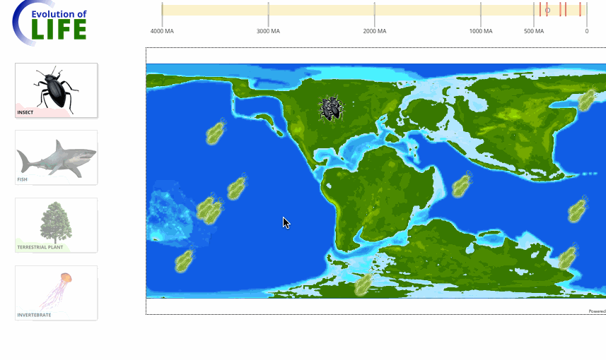

# Evolution of Life

Play the game here! https://davidjvitale.com/tech/evolution-of-life/

This interactive game walks users through the 4 billion year history of Earth by allowing users to populate the Earth with new life as it evolves. Users gain insight into concepts such as continental drift, historic mass extinctions, etc.

You must be in full screen mode on a desktop computer to play. If you can’t see the new life form icons, try zooming out in your browser (we didn’t test on many other computers, apologies for any issues.)

## About

Created during the "Hack the Map 4" Esri internal hackathon by Indhu Kamala Kumar, Amoli Mehta, Nimish Pawar, Denise Vachon, and David Vitale.

View more information [here](https://devpost.com/software/team-blue-giraffes-placeholder).
